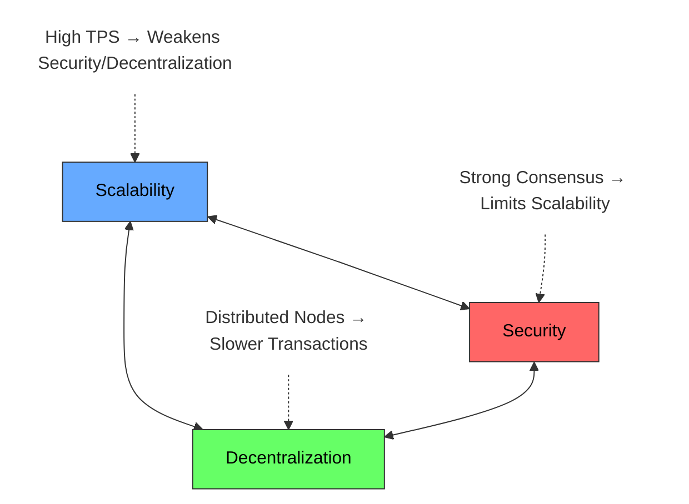

# Lec-7: Sharding & DAS by Dankrad Feist

More info about lecture: [EPF.wiki](https://epf.wiki/#/eps/week6-research)

## Overview

This lecture explains an important piece to [the Surge](https://vitalik.eth.limo/general/2024/10/17/futures2.html#further-progress-in-data-availability-sampling) roadmap i.e. Data availability. The overview includes:

- Blockchain Scalability
- Data Availability Problem
- Data Availability Sampling
- Danksharding construction
- EIP 4844 (Proto-danksharding)

## Sections Timestamp

| Topic                                                                                                  | Time    |
| ------------------------------------------------------------------------------------------------------ | ------- |
| Introduction                                                                                           | 5:15    |
| Outline                                                                                                | 9:10    |
| Blockchain Scalability Trilemma                                                                        | 9:44    |
| The Blockchain Stack                                                                                   | 14:15   |
| The Data Availability Problem                                                                          | 18:51   |
| Data Availability Sampling                                                                             | 26:08   |
| Erasure Coding                                                                                         | 28:15   |
| Ensure valid encoding                                                                                  | 30:45   |
| KZG Commitment Scheme                                                                                  | 32:02   |
| Danksharding                                                                                           | 33:06   |
| Two-Dimensional Polynomial Extension                                                                   | 38:13   |
| Danksharding reconstruction                                                                            | 40:50   |
| Safety from Malicious Majority                                                                         | 41:30   |
| EIP-4844                                                                                               | 42:27   |
| Question: Current state, challenges and future upgrades                                                | 46:19   |
| Question: From where the number of 75% is coming from during the 2D KZG commitment?                    | 50:00   |
| Question: Are there any drawbacks or tradeoffs of Proto-Danksharding from security or PoS perspective? | 50:50   |
| Question: What's your feeling on when a protocol has enough economic security?                         | 1:00:00 |
| Question: What does a world where all ether is staked look like?                                       | 1:02:05 |
| Question: Common misconceptions about sharding?                                                        | 1:06:32 |
| Question: What are some open R&D problems around data availability sampling?                           | 1:08:44 |
| Question: Is execution sharding on the roadmap?                                                        | 1:11:14 |

## Table of contents

<!-- mtoc-start -->

* [Blockchain Scalability Trilemma](#blockchain-scalability-trilemma)
* [The blockchain Stack (Modern perspective)](#the-blockchain-stack-modern-perspective)
* [Data Availability Problem](#data-availability-problem)
  * [Data availability is not data storage (long term access)](#data-availability-is-not-data-storage-long-term-access)
  * [What makes data availability so important?](#what-makes-data-availability-so-important)
* [Data Availability Sampling (DAS)](#data-availability-sampling-das)
  * [Random Sampling](#random-sampling)
  * [One probable solution: Erasure Coding](#one-probable-solution-erasure-coding)
  * [Why to ensure valid encoding?](#why-to-ensure-valid-encoding)
* [KZG Commitment Scheme](#kzg-commitment-scheme)
* [Danksharding](#danksharding)
  * [One Proposer vs Multiple Proposers](#one-proposer-vs-multiple-proposers)
  * [Counter: PBS (Proposer Builder Separation)](#counter-pbs-proposer-builder-separation)
* [Two-Dimensional Polynomial Extension](#two-dimensional-polynomial-extension)
  * [Danksharding reconstruction](#danksharding-reconstruction)
  * [Safety from malicious majority](#safety-from-malicious-majority)
* [EIP 4844: Proto-Danksharding](#eip-4844-proto-danksharding)
  * [Design: Data Blobs](#design-data-blobs)
  * [Features](#features)
* [What after Proto-danksharding?](#what-after-proto-danksharding)
* [Questions](#questions)

<!-- mtoc-end -->

## Blockchain Scalability Trilemma

> Difficult to design such a blockchain that provides scalability, security, and decentralization.

There are two major bottlenecks to decentralization:
1. Execution (systems that run node)
2. Bandwidth (internet speed)

## The blockchain Stack (Modern perspective)

1. Execution (decides that transactions are valid and how state changes)
2. Settlement (root layer for assets on a chain; it determines ownership)
3. Data Availability (how we know everything on the blockchain is available to everyone)
4. Consensus (how we agree on the latest valid block)

> Consensus and Settlement are ***independent*** of the *number of transactions*.

Scaling required on two parts of the stack i.e. Execution & Data Availability.

- *Execution* **requires** all transactions to be checked before executing each one of them.
- *Data Availability* **requires** all the transaction data to be available.
- Hence, both are dependent on the number of transactions and are *directly proportional* to scalability.

*And how we scale both of them?*

For **execution**, its ***Rollups*** and **data availability**, its ***Data Availability Sampling***.

## Data Availability Problem

In its true nature,

> Data availability means that *no network participant*, including a *colluding supermajority of full nodes*, has the **ability to withhold data**.

Data availability is *easy to solve if people trust the majority of nodes* **of being honest**. But then, if it always comes to trust, then it doesn't make it decentralized, hence it's insufficient for a blockchain like Ethereum.

> Verification of transaction validity should be independent of the number of honest validators. This is what makes it decentralized!

Except a few blockchains, almost all blockchains require all full nodes to download all the data (impossible to withhold data).

So, the current pursuit is to make this data availability scalable. Hence, the work required should be less than downloading the full blocks.

So, in summary,

$$\text{Data availability} = \text{Assurance that data was not withheld} = \text{Assurance that data was published}$$

### Data availability is not data storage (long term access)

Data storage is a separate property, much easier to achieve than data availability. The reason behind data storage being easier to achieve are:

- Once published, only one person needs to preserve the data.
- If not published, an honest node can't help.

### What makes data availability so important?

> The data availability problem often sounds like an *unimportant detail* in scaling solutions.

Plasma was meant to be the ultimate scaling solution, yet it failed and had big concerns, partly due to lacking data availability.

The missing pieces get kind of fit with *introduction to rollups*. Rollups use the Ethereum settlement and data availability layer for security and bring their own executions.

To be more precise:

- Optimistic rollups (all data needs to be available unconditionally, or fraud proofs cannot be generated)
- ZK rollups (even with missing data, nobody can make fraudulent transactions because of the *requirement to prove correctness*. With missing witness, blackmailing becomes a possibility)

## Data Availability Sampling (DAS)

With DAS, the goal is to prevent all full nodes to download all data (unnecessary).

### Random Sampling

Via random sampling, *select random bits and hope that if all requested bits are available, all data is available* (This is a one line summary to DAS but with a caveat that bits can't be selected at random, because even a tiny bit of missing data could lead to catastrophe).

Due to the consequences of the retrieval period, this simple idea doesn't work.

Let's understand the complexity to the problem with an example.

Imagine a block as 100 data chunks, but a malicious producer hides just one. A light client sampling 10 random chunks only has a 10% chance of hitting that specific missing piece. This means 90% of the time, the client will miss the hidden data and wrongly assume the entire block is available. To be highly certain of catching that single hidden chunk, the client would need to sample almost all 100, defeating the efficiency goal of being "light."

This illustrates how simple random sampling offers poor security unless the sampling size becomes impractically large.

The takeaway from the above example is *Simple random sampling forces a bad trade-off*:
- **Sample small %:** Very cheap for the light client, but very low security (easy for producer to hide data).
- **Sample large %:** Higher security, but too expensive for the light client (defeats the purpose).

### One probable solution: Erasure Coding
So, random sampling is not a good answer to DAS. The problem with random sampling is if data is lost, it's close to impossible to retrieve.

So, to solve this, we use the most commonly used concept of **Erasure coding**. It is used in cloud servers to store information by adding redundant chunks and reconstruct the whole data using polynomial interpolation with a very less space than replication.

The famous mathematical concept used for reconstruction is Reed-Solomon code.

More on Erasure coding:
1. [Erasure Coding Tutorial: The Key to Efficient File Storage - YouTube](https://www.youtube.com/watch?v=uOj12A6hVSQ)
2. [Erasure Coding in Action: How Big Tech Saves Petabytes of Data - YouTube](https://www.youtube.com/watch?v=VUxXH4uo4AY)

Coming back to data availability sampling and how Erasure coding will be helpful is through.

Let's take an example to understand this further,

- At coding rate `r=0.5`, it means *50% of the blocks are sufficient* to **reconstruct** the entire data.
- Using erasure coding, you just reduced the probability to 50% rather than all the chunks in random sampling which great.
- Now, if you do the same multiple times then, the chance of non-availability reduces by $2^{-30}$
- $2^{-30}$ represents if we query 30 random blocks; the probability that more than 50% not available is $2^{-30}$. Provided the ***encoding is valid***.

### Why to ensure valid encoding?

The valid argument to the same is:

The extension points might not be computed correctly. An attacker could make up random points. If you have any 50% of the points, you can interpolate, but each interpolation will be different. Blockchains require everyone to agree on the same thing. We need to *ensure that whatever is in a block is a correct Reed-Solomon code—a polynomial of the correct degree*.

And how do we do this? **KZG polynomial commitements**!

## KZG Commitment Scheme

>KZG root is very similar to Merkle root. The primary differentiator is KZG commitment schemes are used to commit to a ***polynomial***.

KZG commitments have the property that they always commit to a polynomial, and you can limit the degree of that polynomial.

The primary factor is that all the points that are guaranteed to be on the same polynomial.

To know more about polynomial commitments (also referred the same in [ethereum roadmap lecture](/notes/lec-05-ethereum-research-and-roadmap.md)):
- [ZK Study Club: Part1 Polynomial Commitments with Justin Drakes - YouTube](https://www.youtube.com/watch?v=bz16BURH_u8)
- [ZkStudyClub: Part 2 Polynomial Commitments with Justin Drake - YouTube](https://www.youtube.com/watch?v=BfV7HBHXfC0)
- [ZkStudyClub: Part 3 Polynomial Commitments with Justin Drake - YouTube](https://www.youtube.com/watch?v=TbNauD5wgXM)

Now, we have enough prerequisites to understand **Danksharding** (initially introduced in 2022, [Sharding design with tight beacon and shard block integration "Danksharding" - Fellowship of Ethereum Magicians](https://ethereum-magicians.org/t/sharding-design-with-tight-beacon-and-shard-block-integration-danksharding/8291) and later on a roadmap generated for peerDAS w/ [EIP-4844: Shard Blob Transactions - EIPs / EIPs core - Fellowship of Ethereum Magicians](https://ethereum-magicians.org/t/eip-4844-shard-blob-transactions/8430))

- Also a bankless podcast on Danksharding: [119 - Dive into Danksharding \| Vitalik, Dankrad, Protolambda, Tim Beiko - YouTube](https://www.youtube.com/watch?v=N5p0TB77flM)

Also, another great workshop: [Dude, what's the Danksharding situation? Workshop, Feb 14th, 2022 - HackMD](https://notes.ethereum.org/@hww/workshop_feb_2022)

## Danksharding

Here's the version of sharding pre-danksharding:
- There exists the beacon chain, that adds execution blocks.
- In parallel to the beacon chain, there are 1024 shards-all running in parallel.
- Each shard would have a proposer (shard blocks are confirmed by committee voting),
- Each shard would have its own committee that votes on whether the proposer showed up and if the block is valid (i.e. proposed).

The PROBLEM:
>The problem is that each of these proposers can do **something bad**: each can not *publish their data, or each can publish two different blocks at the same time*.
>
>This might lead to committees with split consensus.

This meant that essentially we have to *wait a long time for these committees to confirm*, and it could *take several epochs* until you knew what each shard block does.

The SOLUTION:
>***One proposer and one committee.***

We can do that because when we have *one proposal*, then we only have **one big committee** that checks for all of these whether this is valid or not.

### One Proposer vs Multiple Proposers

With multiple proposers, it gets really difficult to slash or penalize proposers. It is not a good slashing mechanism if you are slashing proposers for the shards they didn't propose but one evil shard leads to an invalid block. Hence, still the purpose is defeated to incentivize honest work. Also, the time it takes for finalization to reach can take several epochs, as have to wait a long time for these committees to confirm their respective each shard.

Whereas, in a single proposer, the intention is to heavily penalize the dishonest proposer as it is pretty much self-evident that who did the dishonest work. The committee confirms the only shard i.e. block proposed by the proposer.

One proposer might lead to *centralization*, so there has to be a potential counter-measure.

Because while researching MEV, a single/multiple proposer was one of the serious threats to censorship resistance, as proposers would propose blocks that would be largely beneficial to them.

Solution: ePBS (enshrined Proposer-Builder Seperation)

### Counter: PBS (Proposer Builder Separation)

Separation between the functionalities of a proposer and a builder. The proposer has to choose a builder with the most profitable block in their perspective.

The requirement of hardware resources reduces for a proposer to propose & transfers the whole responsibility of block building (quite resource intensive) to builders. A builder is responsible to *construct the beacon block and all the shard blocks at the same time*.

## Two-Dimensional Polynomial Extension

There are two kinds of commitments hence two dimensions:

1. Data Commitments
2. Extension Commitments

Each line will be essentially one polynomial with an extension. But, in addition is we also extend them on the vertical axis.

The nice thing about KZG commitments is because they are linear, you can compute the additional KZG commitments just using polynomial extension as well.

The advantages for doing this are:

- We can reconstruct the data if we have any three quarters of whole square; it doesn't matter which one.

- We can reconstruct in a distributed way by having two layers of validations:
  1. The validators will validate that the builder has done their work correctly.
  2. If the blocks are less than 75% available, it will never get more than $2^{-2s}$ attestations ($1/16$ for $s=2$). Hence, ignored by honest majority.

### Danksharding reconstruction

As soon as a validator node has *50% of one row or column*, that *row or column can be **reconstructed*** using Reed-Solomon code.

***PURPOSE***: The purpose of each validator is to reconstruct any incomplete rows/columns they encounter

Each validator can transfer 4 missing samples between rows/columns (approx. 55,000 validators guarantees for full reconstruction).

### Safety from malicious majority

Future upgrade with data availability sampling will help us ensure safety against malicious majority.

- Each full node will be required to download 75 random samples on the square.
- If they find all the 75 samples, they can say that the block passes.
- The actual percentage for assurance is 75, *as the threshold for 2D is higher than the 1D*.
- The *probability* of an unavailable block passing in 2D is less than $2^{-30}$ i.e. similar to 1D.
- Bandwidth: $75 * 512 \text{ bytes } / 16s = 2.5 \text{kb/s}$.

## EIP 4844: Proto-Danksharding

### Design: Data Blobs

There are two primary constituents of data blobs:

1. Blobs data are stored in a separate network and is separately distributed across the network
2. KZG commitments of the blobs data are stored on the block.

### Features

- Extension of Ethereum to add data blobs to the protocol.
- *Blobs are priced independently from execution (new gas type)*. This massively reduced fees for rollups as uploading calldata on Ethereum as a transaction previously increased the prices extremely.
- *Blobs are not required to compute state updates and will only be stored for a short period*.

## What after Proto-danksharding?

- The construction of EIP-4844 eases future upgrades:
  1. uses *KZG commitments* so that erasure coding can be used (required for DAS, beneficial for networking improvements).
  2. almost all future work can be done without consensus changes and just through networking upgrades.
  3. rollups will also not have to upgrade again to benefit — transition from `CALLDATA` to blobs is sufficient.

>The interface of EIP-4844 will remain the same through all the sharding upgrades. Using blobs, will eventually in a few years have massive data availability benefits via full sharding.

## Questions

*Ques.* Could you eleborate on the current state, challenges and future upgrades?

*Ans.* The idea is to keep a watch and understand the consequences of increasing blob counts and over the years as we get a clearer understanding with other future upgrades, we can increase blob counts.

With related to sharding; there some pretty big hurdles that are needed to be considered.
Full DAS is a replacement from the networking model that currently Ethereum use.

Blockchains currently are working on *broadcasting* i.e. sees all the messages on the network. With DAS, the expectation is to have thinner network, where only small number of nodes store each sample. This idea will eventually help to get a medium amount of scaling. Its implementation is called Peer-DAS. Read more about it here: [PeerDAS from scratch](https://hackmd.io/@manunalepa/peerDAS).

1. PeerDAS is the first stop to scaling the data availability problems Ethereum is currently facing. The problem solved by PeerDAS specificially is: *All samples are still in the network vicinity within one hop of a particular node. Hence a pretty safe and not all the nodes have to store all the data*.
2. The second step to scaling is **Full Sharding**, which is still somewhat a bigger question. It is quite achievable with certain assumptions like dependency on super-nodes to keep all the samples and as soon as one super-node is honest, everything will work fine. The current application to super-node is *Celestia Network*. Many people are not comfortable with the idea of super-node. There is still a lot of research to be done with a fully distributed system in terms of DHT (distributed hash table).

---

*Ques.* From where the number of 75% is coming from during the 2D KZG commitment?

*Ans.* The idea is that you want 75% of the samples to be available, hence,
$$0.75^{x}=2^{-30}$$
which potentially leads to,
$$-\frac{30\log\left(2\right)}{\log\left(0.75\right)} = 72.28262519$$

---

*Ques.* Are there any drawbacks or tradeoffs of Proto-Danksharding from security or PoS perspective?

*Ans.* ***Bandwidth*** has increased after the Dencun hard-fork. A lot of validators experienced high bandwidth increase not caused by the blobs but *due to the attestation aggregation gossip*. In future hard forks, the aim will be to reduce the bandwidth a bit. There is also ways to reduce networking among nodes itself, hence there are lots of optimizations that can be done.

---

*Ques.* How do nodes behave post EIP-4844? How do they get slashed?

*Ans.* Nodes cannot be slashed as they are not bonded. *Nodes can just store the data or not*. Nodes are not expected to store all the data, but at the same time are expected to store the important data at all times. There is a local scoring system that keeps the score of each peer the node connects to. If one the peers ask for a sample that the given node does not have but are supposed to have, then, the given node is not great peer. If it such situation often occurs, then after some point of time, the peers will disconnect with the given node due to mischief.

*No one guarantees that past Ethereum blocks are kept in storage*; it just happens to be the default node implementation. In the future, we will probably include a construction called ***approved custody***, meaning validators have to store data for a while to avoid being slashed. This is a future upgrade, probably a few years from now, because it's not the highest priority.

You really need to rely on honest nodes a lot,
which makes sampling itself difficult.

---

*Ques.* Any other exciting domans of research that you find interesting?

*Ans.* In Ethereum, one big thing is *economics*. Everyone is trying to understand the future of staking. Liquid staking isn't the ideal future, so discussion related to if enshrined liquid staking is worthwhile. Staking simply becomes a pure money game. We need to keep staking more limited. The most dangerous scenario is if the whole protocol becomes staked. We end up in a world where everyone is a stakeholder, and nobody wants their income reduced.

>Ethereum governance would be about how much percent you're making. That seems like a dangerous and dystopian world.

More on this here:

- [Liquid staking maximalism - HackMD](https://notes.ethereum.org/bW2PeHdwRWmeYjCgCJJdVA)
- [Can we find Goldilocks? Musings on “two-tiered” staking, a native Liquid Staking Token design. - HackMD](https://notes.ethereum.org/@mikeneuder/goldilocks)

---

*Ques.* What's your feeling on when a protocol has enough economic security?

*Ans.* I'm (Dankrad) a minimalism on economic security. We don't need more than 1 to 10 billion to secure a protocol. Acquiring enough stake to do something bad to Ethereum is already so secure, no attacker is going to try. Some of the worst cases in terms of economic security are double finalization and purchasing zero-days.

*Read more about double finalization and zero-days*. Resources:
- [Two point oh: Justification & Finalization](https://our.status.im/two-point-oh-justification-and-finalization/)
- [What Happens After Finality in ETH2? - HackMD](https://hackmd.io/@prysmaticlabs/finality)
- [Dynamic Finalization Considering 51% Attacks - Proof-of-Stake - Ethereum Research](https://ethresear.ch/t/dynamic-finalization-considering-51-attacks/21112)
- [Zero-day vulnerability - Wikipedia](https://en.wikipedia.org/wiki/Zero-day_vulnerability)

---

*Ques.* What does a world where all ether is staked look like?

*Ans.* Let's say Lido staked Ether had all the same functions as Ethereum itself, and people on exchanges started trading Lido staked Ether instead of Ether. The difference is that Lido staked Ether still has a yield compared to Ethereum. It would always be more attractive, even if the rewards go down to 1% or 0.5% or less. There's a potential runaway scenario where, even with extremely low yields, they could eat up everything. The only thing Ether would be used for would be paying for gas.

We're not at a point where people would be happy with less than 1% yield, but I can see that eventually happening, and that's what we're quite scared of.

---

*Ques.* Common misconceptions about sharding?

*Ans.* Modern version of sharding i.e. data sharding for rollups necessarily means that there will be no more composibility.

In the case of execution sharding, it gets difficult to perform composable transactions. But in case of rollups, its different because rollups can be designed to inherit the property.

>Rollups don't have to be as decentralized as the base layer because they can be held accountable by the base layer (maintains CR & security).

To some extent, if you're willing to integrate with the base layer proposers, you can even have composability with the base layer on a rollup.

---

*Ques.* What are some open R&D problems around data availability sampling?

*Ans.* THe biggest open question is how to build a robust DHT (distributed hash table).

With blockchains like Ethereum and Bitcoin who broadcast everything, one has to assume that they are connect to one honest node. It's hard to trick nodes that are already well connected in the network.

Problems with DHT is that traditionally P2P networks have no limitations on who can join as a node. But with DHT, the security assumptions are much harder and break down even with relatively minor fractions of malicious nodes. An attacker could add a million malicious nodes to the network, and we would have nothing we could do about it.

There is still no worthwhile design that works on similar assumptions as current P2P network.

---

*Ques.* Is execution sharding on the roadmap?

*Ans.* I view execution sharding very differently nowadays. A lot has changed in the last five years. The way I see some form of execution sharding come back into Ethereum would be that we start increasing the gas limit of the execution layer by putting the execution layer itself onto our data layer and adding a proving mechanism through a ZK-EVM. The base layer would itself become like a rollup; full nodes don't have to verify it anymore. We can get to a point where we can start scaling it itself. It probably won't be as aggressive as rollups, but I can see that we can get 100x or 1000x eventually out of the base layer as well. The cool thing is it will remain fully composable because it's still just one logical shard.
