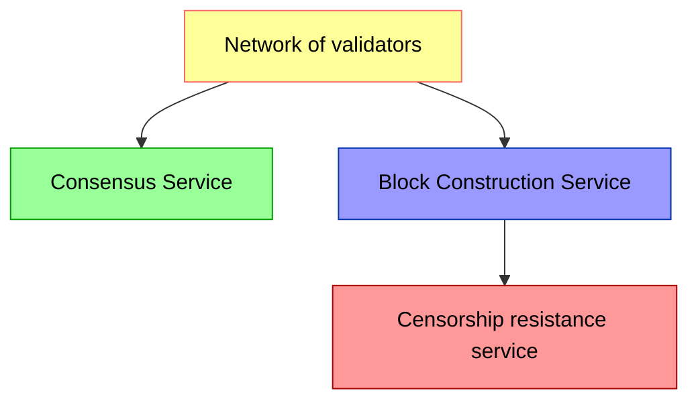
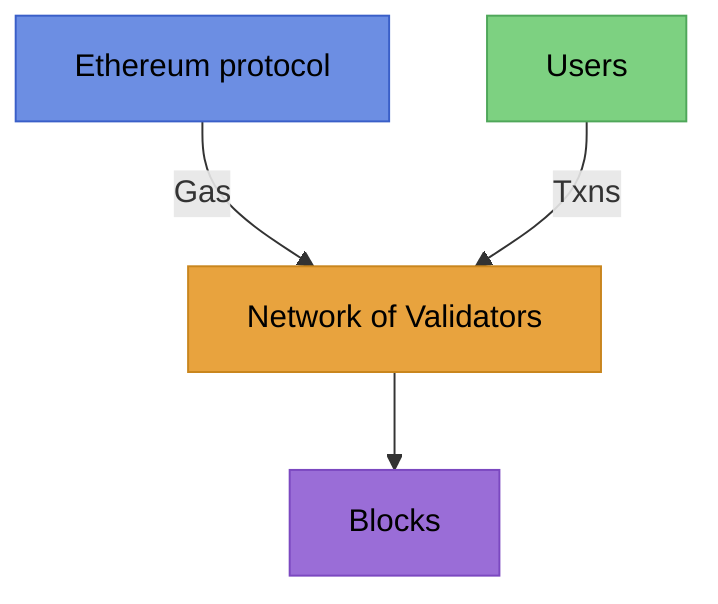
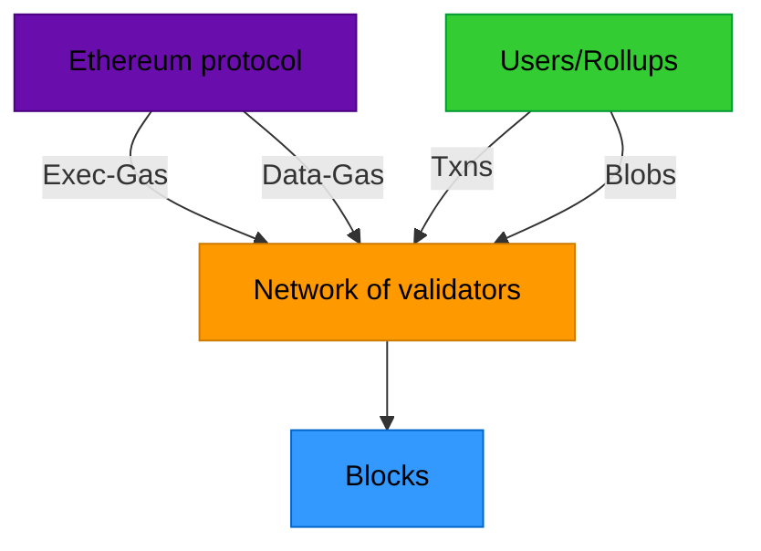
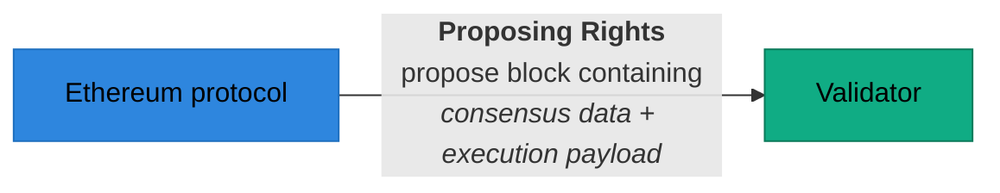
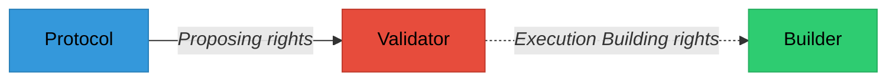
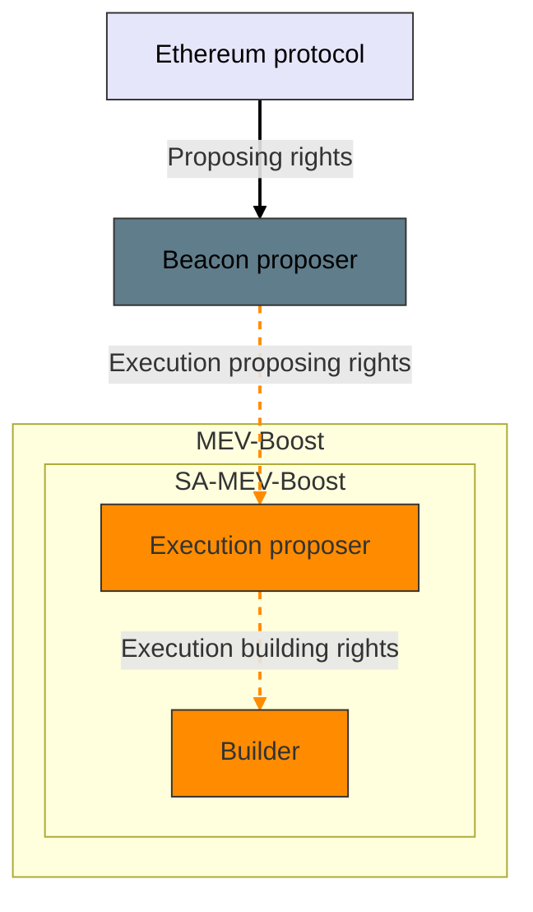
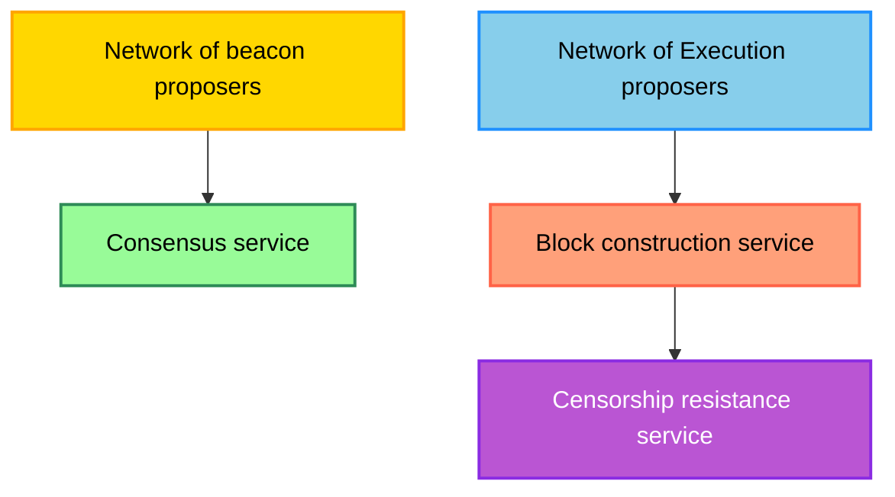
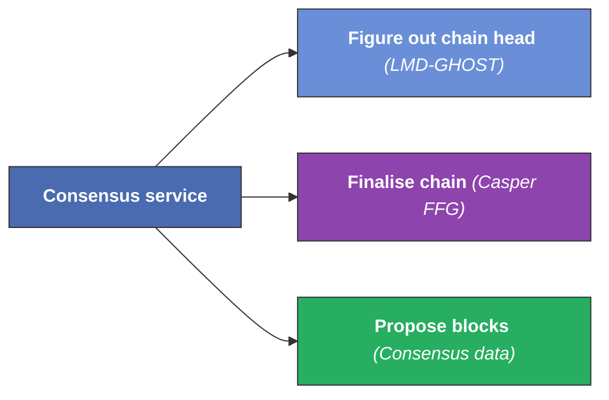

# Lec-11: Procotol Services by Barnabé Monnot

More info about lecture: [EPF.wiki](https://epf.wiki/#/eps/week8-research)

## Overview

The lecture majorly discusses the design philosophy of the protocol along with discussing various protocol services of a concensus layer client. The overview includes:

- Introduction
- Protocol Design Philosophy
- Block Production Service
- Consensus Service
- MEV & Censorship
- Unbundling Validator Roles
- Staking & Delegation
- Inclusion List

## Sections Timestamp

| Topic                                                                             | Time    |
| --------------------------------------------------------------------------------- | ------- |
| Introduction                                                                      | 4:10    |
| Protocol Design Philosophy                                                        | 8:01    |
| Validator Services                                                                | 11:23   |
| Protocol-Validator Problem                                                        | 12:20   |
| The block production service: Role of Validators                                  | 13:53   |
| EIP-1559: Resource Inspector                                                      | 15:30   |
| Question: How unbundling validator roles into sub-roles pan out in the long-term? | 20:15   |
| Ethereum Protocol control over validators: Proposer-Builder                       | 22:20   |
| Protocol's influence on validators                                                | 25:45   |
| MEV-Boost                                                                         | 26:36   |
| Block-Auction ePBS                                                                | 27:34   |
| Slot-Auction ePBS                                                                 | 30:57   |
| Execution Tickets                                                                 | 33:08   |
| Validator Services                                                                | 36:30   |
| Question: Mechanism to redeem an execution ticket                                 | 38:38   |
| Consensus Service                                                                 | 42:35   |
| Rationale for Proof of Stake                                                      | 44:40   |
| Protocol Service Providers                                                        | 48:43   |
| Rocket Pool model                                                                 | 50:36   |
| Only operators are slashable and their issues                                     | 52:51   |
| Rainbow Staking Model                                                             | 58:55   |
| Updated flow of Validator services                                                | 1:01:40 |
| Inclusion Lists                                                                   | 1:02:40 |
| Questions                                                                         | 1:04:29 |

### Table of contents

<!-- mtoc-start -->

* [Speaker's info](#speakers-info)
* [Protocol Design Philosophy](#protocol-design-philosophy)
* [Validator Services](#validator-services)
* [Protocol-Validator Problem](#protocol-validator-problem)
* [Block Production service](#block-production-service)
  * [Validators as Resource Allocators](#validators-as-resource-allocators)
    * [Protocol Aim](#protocol-aim)
    * [User's Play](#users-play)
    * [Validators Obligation](#validators-obligation)
  * [EIP-1559: Resource Inspection](#eip-1559-resource-inspection)
  * [EIP:4844](#eip4844)
* [Protocol control over validators](#protocol-control-over-validators)
  * [Protocol's focus on Proposing Rights](#protocols-focus-on-proposing-rights)
    * [MEV-Boost (external component invisible in the eyes of protocol)](#mev-boost-external-component-invisible-in-the-eyes-of-protocol)
    * [Block-auction ePBS (Enshrined into the protocol)](#block-auction-epbs-enshrined-into-the-protocol)
    * [Slot-auction ePBS (Enshrined into the protocol)](#slot-auction-epbs-enshrined-into-the-protocol)
    * [TLDR;](#tldr)
  * [Execution Tickets](#execution-tickets)
    * [Execution Tickets v/s Slot-auction Tickets](#execution-tickets-vs-slot-auction-tickets)
* [Validator roles](#validator-roles)
* [Questions: Part-1](#questions-part-1)
* [Consensus Services](#consensus-services)
* [Rationale for Proof of Stake](#rationale-for-proof-of-stake)
* [Protocol service providers](#protocol-service-providers)
  * [Rocket Pool Model](#rocket-pool-model)
  * [Two-tiered staking proposal with capped penalties](#two-tiered-staking-proposal-with-capped-penalties)
    * [Role of Light Delegators in Ethereum Protocol](#role-of-light-delegators-in-ethereum-protocol)
  * [Rainbow Staking](#rainbow-staking)
* [Inclusion Lists](#inclusion-lists)
* [Questions: Part-2](#questions-part-2)
* [Wisdom](#wisdom)

<!-- mtoc-end -->

## Speaker's info

Barnabé Monnot, Research Scientist, joined in 2020. Leader of Robust Incentive Group (RIG). RIG focus on research related to game theory and cryptoeconomics in Ethereum.

To understand cryptoeconomics of Ethereum more in depth: [rig.ethereum.org](https://rig.ethereum.org)

## Protocol Design Philosophy

The Ethereum protocol is an abstract object that is a network of machines encapsulating into one single Ethereum.

While designing the upgrades in protocol, one realize that there are things the protocol,

- **sees**
- **acknowledges**
- **coordinate**
- **doesn't really see** (perceive or interpret)

*"The aim for the upgrades is to understand these boundaries, acknowledge them, and push through them and make the protocol more robust."*

More on this: [Seeing like a protocol - by Barnabé Monnot](https://barnabe.substack.com/p/seeing-like-a-protocol)

The questions addressed in the above article:

- Where does protocol credibility come from?
- How far does the protocol extend?
- What should it see?

So, the tldr to all the above questions is:

- Ethereum protocol is setup by a diffuse “community” and “stakeholders” of the protocol i.e. “Rough consensus” governance.
- Ethereum community → Ethereum Protocol → Network of validators
- *Protocol's goal*: **“Decentralised provision of block space for users to achieve maximal welfare ⇒ minimal rents.”**
- Validators (stakeholders) runs the protocol.
- Incentive of the protocol should be not let validators extract more rent than expected.

## Validator Services

*Consensus Service*: provide finality to the chain, make sure that we all agree on the state and the history of Ethereum.

*Block Construction Service* (liveness service): keep adding more useful things, more user transactions, more ways for the users to interact.

*Censorship Resistance service*: prevent block constructors from suppressing transactions on chain for any reasons and provide *neutrality*.

## Protocol-Validator Problem

Validators can help achieve the goals of protocol by:

- **Protocol inspection**: provide signals of the environment in protocol state.
- **Protocol agency**: protocol then respond to such signals with updates, rewards, or punishments.

## Block Production service

### Validators as Resource Allocators

- Protocol lets validators-as-block-producers *consume* resources.
- Supply constrained to guarantee *low verification costs*.
- Validators produce blocks, meeting *demand for transactions* with *supply of resources*.

#### Protocol Aim

The protocol's generally aims to keep the nodes light enough for people to run them and for the system to stay decentralised.

>Protocol aims to handle *supply of gas*.

#### User's Play

User demands for the block space so that their transaction go through and aren't suppressed by the blockchain by any means.

>Users aims to generate *demand of gas*.

#### Validators Obligation

Validators in the middle and are obliged to allocate the best use of gas (in accordance with protocol) to these transactions (submitted by the users). In return, are rewarded for doing their duty as per norms.

### EIP-1559: Resource Inspection

Protocol quotes a reserve price, dynamic congestion pricing.

The aim of the EIP is to regulate the use of gas sustainably. With this EIP, there are no sharp incline or decline of demands hence validators are only allowed to allocate until a certain threshold (changes each block based on demand).

- **Demand signal**: Block target 15M gas use, block limit 30M (now *36M*, early February 2025 and enroute for *60M* by EOY)
- **Update Rule**: If: Gas use > Target ⇒ Reserve price increases.

Read the research paper on EIP 1559 from [Transaction Fee Mechanism Design for the Ethereum Blockchain: An Economic Analysis of EIP-1559 - Tim Roughgarden](https://arxiv.org/pdf/2012.00854).

Also:

- [Congestion control and eip1559 - by Barnabé Monnot](https://barnabe.substack.com/p/congestion-control-and-eip1559)
- [Understanding fees in eip1559 - by Barnabé Monnot](https://barnabe.substack.com/p/understanding-fees-in-eip1559)
- [Better bidding with eip1559 - by Barnabé Monnot](https://barnabe.substack.com/p/better-bidding-with-eip1559)

### EIP:4844

Proto-danksharding, i.e. EIP-4844, aims to provide a 2nd dimension to EIP-1559.

EIP-4844: Separate *“exec-gas”* with *“data availability gas”*

When a user makes transaction (sends data) to the blockchain, the instruction is shared through *calldata*.

When a rollup makes a transaction (makes data available) to the blockchain, the intention is to make data available for period of time through *blobs*.

Exec-gas and blobs-gas are monitored differently. The rise in exec-gas does not alter the blobs-gas price and vice versa. Hence, a 2-D implementation of the same EIP-1559 is executed for two orthogonal use cases.

*Ques.* How unbundling validator roles into different sub-roles like proposer, builder, attestor, delegator, etc. help the community better exercise control over validators long-term?

*Ans.* Unbundling validator roles gives more control as a community. It's very hard to fit a very big object into a specific door. By unbundling, by creating these different gadgets and facilities, *we exercise community control and decentralize actors outside the protocol*.

## Protocol control over validators

The protocol as of now, does not fully-control the behaviour of validators. It does have the ability to reward and penalize the validators for any good and bad they do. But, it has partial control over block construction (due to EIP-1559).

Protocol really doesn't care about how the transactions until the transactions that are added to the blocks have paid the base fee for inclusion.

Validators decide the order of transactions. So, they try to order the transactions in such a way that they can earn more than the rewards they receive from the protocol, i.e. MEV.

Validators delegate the task to find the most valuable block (whichever makes their pocket greener) to an *external network of builders* and only participate in proposing the same block to the protocol.

Builders use MEV-Boost to build profitable blocks. Refer [mevboost.pics](https://mevboost.pics/) for stats related to MEV-boost.

This whole process we discussed is external, and is individual choice of a validator to opt to. But due to the shift in political economy, 90% of the validators use external network of builders. And the protocol has no control over this.

*Solution*: Enshrine builders into the protocol, so that it is aware of the repercussion i.e. **ePBS**.

### Protocol's focus on Proposing Rights

- The consensus data is information about attestation, finality, etc.
- The execution payload is a list of transactions (built by builders).

Different version of validators transferring the process of building blocks are:
1. MEV-Boost
2. Block-auction ePBS
3. Slot-auction ePBS

#### MEV-Boost (external component invisible in the eyes of protocol)

> Dotted lines means optional interactions.

- Protocol transfer the proposing rights to a validator.
- And sequentially the validator allows the builder to build the execution payload by providing building rights.
- Propose the execution payload which is most profitable.

This whole thing is a single step process.

#### Block-auction ePBS (Enshrined into the protocol)

With Block-auction ePBS, the whole process breaks into two step process.

*Step 1:* Protocol provides proposing rights to the validator.

*Step 2:* This is now conditional:
  - Beacon proposer (validator) commits to execution proposer+builder.
  - Beacon proposer can commit to self in case of local building (not using builders to extract MEV).

The beacon proposer's commitment to the execution proposer is guaranteed by the protocol. If a payment promise becomes canonical (the beacon block goes on-chain and is attested to with enough weight), it's the builder's responsibility to propose the block in time.

#### Slot-auction ePBS (Enshrined into the protocol)

In this version, the beacon proposer only commits to who will propose the execution payload—only the pseudonym or public key of the execution proposer, not the block contents.

>The execution proposer who wins the ticket might resell the building rights.

The beacon proposer could give themselves execution proposing rights and then listen to offers from a builder. They could bypass the system and have a second system to decide who the execution proposer should be. This gives more flexibility; you don't have to commit to the block contents when making the bid. You can buy the right to make the execution payload and then resell the building rights. This decouples the beacon proposer from the execution proposer. The beacon proposer is still responsible for choosing the execution proposer, but not for committing to the block content.

#### TLDR;

There are two variations to ePBS:

- In block auction ePBS, the *beacon proposer commits to both the builder and the block contents*.
- In slot auction ePBS, the *beacon proposer only commits to the execution proposer's identity, not the block content*. This gives more flexibility to the execution proposer.

### Execution Tickets

Validators no longer choose the execution proposer; a market (the execution ticket market) created in the protocol chooses it. Anyone can buy a ticket, which redeems to become an execution proposer.

We have the same separation between proposing and building rights (as in slot-auction ePBS). If I own a ticket giving me the right to propose a block, I can still outsource or resell the building rights.

We might still see MEV boost and relay infrastructure in this model. Because this market is a protocolgadget, we have introspection on who comes to the market and how much they're willing to pay. This introspection is credible, and we can capture the value people pay.

#### Execution Tickets v/s Slot-auction Tickets

In Execution Tickets, the auction market can be enshrined in the protocol allowing the protocol for burning and value capture. The proposer is only provided with proposing rights and the execution proposing rights are auctioned by the protocol.

In slot auction EPBS, we can't naively burn because the beacon proposer can misrepresent the bid value.

More on PBS:

1. [Notes on Proposer-Builder Separation (PBS)](https://barnabe.substack.com/p/pbs)
2. [Reconsidering the market structure of PBS — The price of agency](https://mirror.xyz/barnabe.eth/LJUb_TpANS0VWi3TOwGx_fgomBvqPaQ39anVj3mnCOg)
3. [More pictures about proposers and builders — The price of agency](https://mirror.xyz/barnabe.eth/QJ6W0mmyOwjec-2zuH6lZb0iEI2aYFB9gE-LHWIMzjQ)

## Validator roles

Updated responsibilities of Validator services after understanding about ePBS,

With the separation of validators rights, we were able to solve the issue of toxic MEV, proposers were trying to extract which was not visible to the protocol.

The issue now is execution proposers are likely to be *centralized and sophisticated entities*, responsible for the chain's censorship resistance.

The censorship resistance service should be provided by validators (they are the stakeholders, rewards & slashing possible hence incentivized).

A decentralized set of operators, expresses a wider set of preferences, for example:
- **include** *transactions* which *others dislike*.
- when participating in consensus, **decorrelation ⇒ resilience**.

## Questions: Part-1

*Ques.* With execution tickets, does that change the frequency a particular validator has the rights to propose a block, or what is the mechanism for redeeming an execution ticket?

*Ans.* [Execution Tickets - Proof-of-Stake / Economics - Ethereum Research](https://ethresear.ch/t/execution-tickets/17944), the proposal is written by Justin and Mike and the basic idea behind it is: *there is this market that exists, and you can go to the market and buy the tickets to become an execution proposer.* Unlike slot-auction ePBS, the validator is only the beacon proposer and not the execution proposer. If he wants to build a block as well while proposing, he needs to go to the market and buy the ticket.

The ticket in this scanrios is almost like an AMM marketplace, where there is a supply of tickets for block builders to buy. But now the next questions which are to be figured out are: *If I want to buy a ticket, do I make a transaction that goes in one of the execution payloads, or is that a transaction that lives in the consensus layer, and who includes that transaction?*

---

*Ques.* Offline validators and double voting would be slashed with execution tickets?

*Ans.* Except for the building rights, everything stays the same as today. Validators won't be required to include execution payloads while proposing.

And so if a validator was, for instance, proposing two beacon blocks at the same height, or if a validator was making conflicting votes that are *slash-able*, they would be slashed according to the same mechanics that take place today. Another validator would include a proof of why validator A needs to be slashed; that proof would be contained in the beacon block.

## Consensus Services

- LMD Ghost (Fork choice rule) to figure out current head of the chain.
- Casper FFG (Finalise chain), helps finalise blocks in the **antepenultimate epoch**.
- Consensus data, validators cast finality votes in Casper FFG and giving weights in LMD Ghost. All this info are to be stored in the upcoming beacon blocks.

## Rationale for Proof of Stake

A question might arise, *why do we need 32 ETH to become a validator❓*.

The answer to it is we want to be able, as a protocol or as a committee, to say we have a **credible commitment** to providing good quality of service.

And according, to ethereum protocol, the only thing perceived is the above diagram.

>Anything else (contract deposit, queue/dequeue ETH, allocate ETH, validate) is **invisible** to the *eyes of the protocol*.

The invisible part to Ethereum protocol looks like:

```mermaid
flowchart LR
    %% Define nodes with colors
    Staker(["Staker"])
    DepositContract(["Deposit contract"])
    Buffer{{"Buffer"}}
    NodeOps(["Node operators"])
    EthProtocol(["Ethereum protocol"])

    %% Style nodes
    classDef staker fill:#ffffc0,stroke:#d4d4aa,color:black
    classDef deposit fill:#ffe6c0,stroke:#d4c0aa,color:black
    classDef buffer fill:#ffffff,stroke:#000000,color:black,stroke-width:2px
    classDef nodeops fill:#c0e6ff,stroke:#aac0d4,color:black
    classDef protocol fill:#e0c0ff,stroke:#c0aad4,color:black

    %% Apply styles
    class Staker staker
    class DepositContract deposit
    class Buffer buffer
    class NodeOps nodeops
    class EthProtocol protocol

    %% Define connections with labels
    Staker -->|"Deposit ETH<br>Receive stETH"| DepositContract
    DepositContract -->|"Queue ETH"| Buffer
    Buffer -->|"Allocate ETH"| NodeOps
    NodeOps -->|"Validate"| EthProtocol
    DepositContract -->|"Dequeue ETH"| Buffer
    EthProtocol -.->|"reward/slash"| NodeOps

    %% Reverse flow
    DepositContract -->|"Deposit stETH<br>Receive ETH"| Staker
```

With stakes, validators can be made accountable for the good and bad things they perform on the protocol. And protocol receives a commitment for the same from the validators.

>*Node operators* abstract the whole concept of staking from Ethereum protocol.

Also, when capital is staked into the deposit contract, it can't be reutilized (aka. locked ETH). To supply the same locked ETH, with maximum efficiency, liquidity protocols provide users to stake ETH in the deposit contract through them, and in exchange receive a liquidity token which can be swapped for ETH anytime (it also incur interests with time).

"If X happens, Y billion of dollars are lost," it doesn't really specify whose dollars. The protocol only knows to slash/reward a node operator (validator node).

## Protocol service providers

There are two classes of providers:

- **Solo operators**: A *pirori untrusted*, think living room validators, solo stakers (operators + own capital)
- **Professional operators**: A *priori trusted*, registered companies, big staking providers

It looks a very black and white kind of distinction, but it's in truth, it's not that binary. It's more like a credible signal, that is understood over time.

Liquid staking protocols, could employ a mixture of both types. For example, Lido onboard solo stakers: [Link](https://blog.lido.fi/community-staking-module-new-era-for-solo-stakers/). Similarly, Rocket Pool is mostly consumed of solo operators that stake.

Also read more about:

- [Distributed Validator Technology: Decentralizing Ethereum's Proof-of-Stake \| HackerNoon](https://hackernoon.com/distributed-validator-technology-decentralizing-ethereums-proof-of-stake)
- [SSV](https://docs.ssv.network/learn/introduction)

### Rocket Pool Model

Operators can be solo stakers, put some ETH  as collateral, delegators fill the remainder.

The interesting part of Rocket Pool is that, if you as a node operator gets slashed, first you loose your staked ETH, and then the delegators loose theirs. *But both are slashable*.

Still, capital efficiency + cost pressure mean *LSPs rely on professional operators significantly*.

Read more about Rocket Pool:

- [Rocket Pool Docs Overview](https://docs.rocketpool.net/overview)

### Two-tiered staking proposal with capped penalties

There is a problem of **trust** between *operators* who may be untrusted and *delegators* who are delegating to them. And to solve this problem, some researchers are talking about an idea to resolve the problem of trust by *slashing ETH of only operators and not delegators*.

More related to this:
- [Can we find Goldilocks? Musings on “two-tiered” staking, a native Liquid Staking Token design. - HackMD](https://notes.ethereum.org/@mikeneuder/goldilocks)

But again, based on idea proposed, there are two premises:

1. People want to stake and put their ETH to good use (incur staking interest over time). They will use liquid staking protocols instead
2. We can make only the people who actually perform validation (the operators) liable.

This idea faces a few issues:

1.  It's predicted that yield-seeking delegators would still provide capital to the operators to be put at risk (effectively becoming "heavy delegators"), recreating a similar risk dynamic and operator-delegator separation where the operator's stake largely comes from others willing to accept slash conditions for higher potential returns.
2. It raises the question of why "light delegators" (those whose funds are not slashable in this model) should receive yield, as their capital isn't directly providing the economic security that comes from being slashable. Their contribution or useful service to the protocol becomes less clear in this context.

#### Role of Light Delegators in Ethereum Protocol

Vitalik wrote an article on the role of light delegators in ethereum:

- [Protocol and staking pool changes that could improve decentralization and reduce consensus overhead - HackMD](https://notes.ethereum.org/@vbuterin/staking_2023_10)
In this article, Vitalik suggested that Light Delegators could perform useful services such as:

1. **Backstopping Consensus:** They could *run their own fork choice* logic to monitor and verify the work of the =="heavy layer"== (slashable operators/delegators), acting as a second layer of defense to ensure the chain's integrity and detect foul play.
2. **Creating Inclusion Lists:** They could periodically come online to propose "inclusion lists," which are mechanisms to compel block proposers (execution proposers) to include specific transactions in their blocks, thus helping to counter censorship or ensure transaction inclusion.

### Rainbow Staking

[Source](https://ethresear.ch/t/unbundling-staking-towards-rainbow-staking/18683)

Rainbow Staking is presented as a model or concept for organizing different staking services within Ethereum. It envisions a structure with two main components or layers:
1. A **"heavy" layer** on the left, responsible for providing economic security through *slashable stakes*. These are the heavy operators *validating the chain and making credible commitments*.
2. A **"light" layer** on the right, responsible for performing "light services" that act as *backstops or supplements* to the core consensus services (like running light fork choice or creating inclusion lists). This layer is described as *not being slashable*.

Rainbow Staking improves the operator-delegator issue, particularly on the **light layer**:
1. **Unbundling on the Light Layer:** It anticipates that light delegators won't perform the light services themselves but will instead back or give weight to specific "light operators" to perform these tasks (like backstopping fork choice or creating inclusion lists).
2. **Reduced Trust Requirements:** Because the light layer is not slashable, the intense trust assumptions and capital risks associated with the heavy layer (where operators handle slashable funds) are significantly reduced. Light delegators can back light operators based on reputation or observed positive actions (e.g., community participation) without the fear of losing their delegated assets to slashing caused by the operator.
3. **Friendlier to Untrusted Solo Operators:** This lower-trust environment makes the light layer more accessible and "friendly" to solo operators who might otherwise be considered untrusted in the high-stakes, slashable heavy layer. It allows them to contribute valuable services without needing the high collateral or established reputation required for heavy operators.

Hence, the updated flow of validator services looks like:

Now, the heavy layer is going to be responsible for consensus service that requires for economic security and a credible commitment to good service provision. The censorship resistance service will be done by the light layer, and that will kind of constrain the block construction service.

A complex version for the same:

## Inclusion Lists

The real definition of inclusion list:

"A way for the most decentralised set of Ethereum to input their preferences into the make-up of the chain."

***The key goal: Block co-creation***

- [eip-7547: inclusion lists](https://eips.ethereum.org/eips/eip-7547)
- [rop-9 multiplicity gadgets](https://efdn.notion.site/rop-9-multiplicity-gadgets-for-censorship-resistance-7def9d354f8a4ed5a0722f4eb04ca73b)
- [Committee-enforced inclusion sets (COMIS)](https://ethresear.ch/t/the-more-the-less-censored-introducing-committee-enforced-inclusion-sets-comis-on-ethereum/18835)
- [Fork-Choice enforced Inclusion Lists (FOCIL)](https://ethresear.ch/t/fork-choice-enforced-inclusion-lists-focil-a-simple-committee-based-inclusion-list-proposal/19870)

## Questions: Part-2

*Ques.* Is there any existing mechanisms, for addressing the bypassability in ePBS?

*Ans.* MEV burn mechanism (ethresear.ch link shared below) was using the power of the attesters, who are the other parties involved in the consensus service, to kind of observe the bids that are flying on some gossip channel and force the block proposer to choose a bid that maximizes the value.

So I don't actually think the bypassability will be fully resolved wrt MEV burn mechanism or even execution tickets.

I think in many different places that we don't really see the kind of trusted stack of MEV boosts disappearing.

Read more about it here: [MEV burn—a simple design - Economics - Ethereum Research](https://ethresear.ch/t/mev-burn-a-simple-design/15590)

---

*Ques.* What are the implications of restaking and how it is different from enshrined restaking? 1:07:16

*Ans.* Restaking is almost like you're adding—you're adding services to what the validators are doing, but in a way that the Ethereum protocol doesn't really see.

For example: you've restaked to promise that you would provision some on-chain bandwidth for data availability service i.e. Eigan DA.

Enshrined restaking means to make the protocol realise about the services and enshrine them into the protocol itself, hence validators stake collaterals themselves.

THe features or services that might get added into the future are inclusion lists, pre-confirmations. These services require economic security (staked ETH), hence protocol should be able to see through these services inherently.

---

*Ques.* Which services are to be classified as heavy services? Also will pre-confirmation also fall into the same category?  1:10:30

*Ans.* The best way to think of heavy services is to just observe what's currently on-chain today. People doing the work of signing these votes, attestations, and yeah, getting the network to come to finality.

Ethereum as a PoS blockchain does not have in-protocol delegation service (a semi-conscious choice to go in that direction). Hence, there is a vast existance of Lido, Rocketpool, and other liquid staking protocols. With time, we need the protocol to do more hence we need to enshrine more things. You can't really enshrine liquid staking protocols but you can enshrine gadgets that lower the barrier to entry for the market of liquid staking protocols to keep the scene competitive. You can have native delegation that can be made fungible into a basket of shares (something like cosmos).

---

*Ques.* What is the incentive to run as light since we know that these delegators often don't pay heed to small differences in risk factors, and we know that slashing events rarely affect delegators since protocols often cover those events? 1:13:56

*Ans.* They wouldn't have to choose between heavy delegating and light delegating; like they could do both in the sense that they could restake their heavy delegation into the light services. So they could still kind of provide this useful service of surfacing who are the light operators that are doing a good job at censorship resistance or at backstopping the heavy operators.

When it comes to the heavy operations, as a staker with money on the line, I might select like conservatively; I might say I really require like credibility, which means I want to go to like liquid staking protocols that are credible.

But then when it comes to the light operators, maybe I have a very different preference function based on the fact that I'm looking for different things now that it's not just a money problem. We can't have everyone on the network trying to make an inclusion list. So we have still this leader selection problem of figuring out who are the people who should be making the list or who should be like making messages for the protocol to read and to execute on.

---

*Ques.* What is the vital difference between dPoS and PoS in terms of proposal design? 1:19:28

*Ans.* PoS, in general, is as permissionless as possible to become a validator. When Ethereum decided to adopt PoS as a succession consensus mechanism to PoW, PoS was still quite a new topic and there were many unknowns (quite an untested concept).

One thing about dPoS that the liquid staking module does—is when delegate my stake to someone, I can mint that act of delegation as a share, and I can then provide that share to a liquid staking protocol who's going to aggregate all of these shares and kind of curate a basket of shares.

There's a lot of heterogeneity in even what people call delegated proof-of-stake.

- [Endgame Staking Economics: A Case for Targeting - Proof-of-Stake / Economics - Ethereum Research](https://ethresear.ch/t/endgame-staking-economics-a-case-for-targeting/18751)

---

*Ques.* Whether you have any advice on how to think about these open problems, how to analyze them, where to study more, what to study? 1:23:00

*Ans.* I tend to be very quiet for a while, just accumulate input for a long time, and then like the dam bursts, and suddenly like I—I can just write the whole thing. Then, of course, it took me more time to polish it.

What's really nice with this community is the wide network of collaborators and people being really available.

## Wisdom

The best way is to read as much as possible, like any paper that has been written or post or blog post or talks. What's really nice and also terrifying sometimes is the wealth of information on all of these things. Like it doesn't make sense.

And one advice I often give is to make your own way through it; *don't be afraid to repeat arguments that people have made, like even write them for yourself*.

