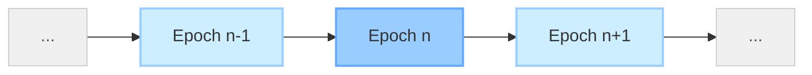

# Lec-13: The Purge by Piper Merraim

More info about lecture: [EPF.wiki](https://epf.wiki/#/eps/week9-research)

## Overview

This lecture is about The Purge (one of the tangents of Ethereum roadmap). The overview includes:

- Protocol Cleanup
- 4444 (History Removal)
- Self-Destruct Removal
- Precompiles (Removal/EVMification)
- State Expiry
- Address Space Expansion
- Log Reform
- Gas observability removal

## Sections Timestamp

| Topic                       | Time    |
| --------------------------- | ------- |
| Introduction                | 3:30    |
| The Purge: Overview         | 6:20    |
| Block Execution             | 8:10    |
| Limitations of MPT          | 11:17   |
| Verkle Trees                | 17:06   |
| History Expiry              | 18:40   |
| Removal of `SELFDESTRUCT`   | 24:45   |
| Precompiles                 | 33:00   |
| Questions                   | 38:00   |
| State Expiry                | 45:50   |
| Address Space Expansion     | 52:14   |
| Questions                   | 55:30   |
| Log Reform                  | 1:04:50 |
| Gas Observability           | 1:11:00 |
| Portal Network              | 1:13:50 |
| Questions related to Portal | 1:21:45 |

## Table of contents

<!-- mtoc-start -->

* [The Purge: High-level Overview](#the-purge-high-level-overview)
* [What happens during Block Execution?](#what-happens-during-block-execution)
* [Limitations of MPT](#limitations-of-mpt)
* [Innovation with Verkle Trees](#innovation-with-verkle-trees)
* [History Expiry](#history-expiry)
* [`SELFDESTRUCT`](#selfdestruct)
* [Removal of Precompiles](#removal-of-precompiles)
* [Questions: Part-1](#questions-part-1)
* [State Expiry](#state-expiry)
* [Address Space Expansion](#address-space-expansion)
* [Questions: Part-2](#questions-part-2)
* [Log Reform](#log-reform)
* [Gas Observability](#gas-observability)
* [Portal Network](#portal-network)
* [Questions: Part-3](#questions-part-3)

<!-- mtoc-end -->

## The Purge: High-level Overview

> The purge could be picturized as Protocol vomiting into a toilet, i.e. some not so useful aspects of the protocol are to be removed as it evolves.

There were a lot of mistakes during the initial protocol design phase. The reasons behind removing those mistakes, because they are:
- not working
- fundamentally wrong
- limiting us from doing things.

## What happens during Block Execution?

A **block** is a *series of transactions*, and each one of those transactions gets *executed in a block*.

The transaction consists of receiver address, calldata (that gets fed into the EVM).

Ethereum state is represented in Merkle Patricia Tree (MPT). The tree's root is a state root that represents the whole tree state (at that instance). The leaves of the tree are where the accounts reside.

In the case of EOA, there is no concept of state in the accounts (leaf) node. But if the node address that is traversed through, is a *contract* where the contract's codehash and storage root is stored. Storage root has its individual state trie (account storage contents trie) mapped to the same address (contract).

During the block execution, each transaction has a *gas limit*. In order to execute a valid transaction, the EVM is required to access the state trie, to fetch data relevant to the call. To access state, the traversal has to be through these high billions value of state nodes.

> In order to do block execution, what you're effectively doing is ***random access*** all over the state trie, and it is a big ugly data set.

## Limitations of MPT

During the initial Ethereum Protocol design i.e. **2014** *(aka. Ethereum early development)*. The early implementation of MPT started with a naïve approach. All the state data was stored in the leaves of the trie, so in order to retrieve, the only way was to traverse the account address (EOA/contract), and get the information. But, as years passed, the increase in state bloat made it infeasible to use MPT. To fetch an information, the traversal requires going 7 layers deep, and if its a smart contract storage state access, the number worsens.

Even upgrading the key-value database from LevelDB to RocksDB, didn't alter the results too much.

>Access pattern is $O(log(log(n)))$

After lot of research, client teams where able to discover a ***flat database design*** that had $O(1)$ access (to access any dataset for a given key, just go for straight access).

(Read more about the client teams that have adopted the flat database design, might be Erigon, Reth)

But, still the major bottleneck, is ***disk I/O*** because the state access is very random
access, and the state itself is very, very large.

The solution to overcome the bottleneck, was the idea of ***witnesses*** (proof of all of the state that a block accesses). Don't need to access state in *order to verify if its valid*.

> The major problem with MPT, is that it *generates inefficient proofs* (witnesses).

It can easily be attacked and even the size of the proofs were in hundreds of MBs. The reason behind is the branching factor of 16. At every level, if you want to provide a proof, then it requires other 15 node elements as well along with the one you want the proof of (to have a full proof for execution data).

Hence, emerges Verkle tree.

## Innovation with Verkle Trees

The need of a different tree design with much more succinct proof shape in order to have a stateless environment where we can just distribute proofs around to verify.

Getting proofs is just a piece of the puzzle and is solved by Verkle trees.

## History Expiry

Over time, there are various properties of ethereum, that have grown *linearly*. These factors were not necessarily fundamentally killing Ethereum but were the ***major bottlenecks*** towards the roadmap to *scaling*.

One of the examples of major bottlenecks are **blocks**. Blocks is by principle will only increase with time as it has since genesis (current block: 22294034). Clients only require the latest 128 blocks, and only the state of these 128 blocks are synced and the rest are unaccessed and hence is history.

Before the merge, the only time the node was required to access the all of history is during the full sync from genesis. But with beacon chain's weak subjectivity, the node can sync from the weak subjectivity checkpoint and is required to get the information of the latest blocks in order to stay synced and generate the state trie throughout the period of the latest 128 blocks (so no need of historical blocks).

A lot of Ethereum’s state hasn’t been accessed in years. Yet, all nodes are burdened with this data forever.

The solution is: [EIP-4444: Bound Historical Data in Execution Clients](https://eips.ethereum.org/EIPS/eip-4444). The abstract of EIP states,

>***"Clients must stop serving historical headers, bodies, and receipts older than one year on the p2p layer. Clients may locally prune this historical data."***

But history expiry has been difficult to figure out for the following reasons:

- From where the historical data is going to come?
- How are clients going to sync to the front of the chain?
- What if we lose the historical data?

Loosing the historical data is least of the concerns among the rest. Piper Merriam quotes,

>*"It is my belief that the chance of us losing the history of Ethereum is near zero."*

But, the main problem is the *source* from where we get that data reliably.

4444 is the tech-debt cleanups which says that clients don't need to keep the deep history.

There are various solutions clients are looking at:

- *Torrent-based* solution (Erigon is thinking of adopting bit-torrent to sync).
- Another possible solution being adopted is *Era or Era1*. (Era1 is very much compatible with torrents)
- *Portal* (live, distributed, on-demand p2p networking protocol for storage and retrieval of Ethereum data)

>Era or Era1 files are a long-term archival file format for ethereum historical data. More information here: [Era store - The Nimbus Guide](https://nimbus.guide/era-store.html).

>More information related to Portal is [Portal Network](https://ethportal.net/)

## `SELFDESTRUCT`

`SELFDESTRUCT` opcode *clears the storage data for a contract*. A formal definition to the opcode is:

>Halt execution and register account for later deletion or send all Ether to address (post-Cancun). Read more: [SELFDESTRUCT](https://www.evm.codes/?fork=cancun#ff)

The basic idea behind self-destruct is when called, the state stored that is associated with the contract goes away.

The state tree stores the account information i.e. nonce, balance and storage (in case of contract) in its leaves. But really, the *storage root and codehash* are the ***reference*** to the *account storage trie* and the *bytecode* of the contract respectively.

Now, it upto the client to decide on where to store this piece of information. A client has to decide in its implementation:

- Am I going to de-replicate contract code?
- Am I going to do reference counting?
- Am I going to just leak contract code?

Like shared above, the bytecode of the smart contract is not stored in the state trie but instead the client is given the responsibility to store it. The naive implementation is every time the client receives contract creation call, then it will store it in key-value database under code hash which is then referenced in the smart contract account. Same happens for the account storage trie.

This creates two major problem when calling `SELFDESTRUCT` opcode:

1️⃣ The codehash might be referenced to multiple smart contracts (same bytecode might be deployed by someone else). Hence, the codehash-bytecode key-value can't really deleted from the client database.

*Consequence*: clients store it, and then they never delete it, which means that a long-running Ethereum client is actually accumulating extra code that it shouldn't be holding on to because of this whole implementation.

*Solution*: Verkle actually stores the code itself inside of the main state tree. So these are some of the places where we needed to do cleanup.

2️⃣ The account storage trie of smart contract might have 1B individual nodes that are to be deleted individually as at end are key-value pairs. And the state root of the account storage trie is stored in the storage-root in the smart contract account info. Thus, when a self-destruct comes through in this model, in the old Merkle Patricia Tree model, a client can go through and actually delete every single one of these out of their database.

*Consequence*: a contract might have one, two, or a hundred billion state entries in its database. When you run into that hundred-billion model and you implement your client so that it walks through this tree and deletes every one of these keys out of your database, all of a sudden your client hangs while executing a block because it spins a couple of hours digging through its database deleting all of this stuff. This could potentially used to DoS ethereum.

*Solution*: In the old Merkle Patricia Tree, we can kind of get around this by *just nuking this reference* and just leaving account trie around if we want to. But now, with Verkle Trees being implemented, the account storage trie is inherited into the main trie. **Now using self-destruct would be suicidal for the network and can be used against the chain by Denial-of-Service (DoS) attacks.**

***Final Solution***: Removal of `SELFDESTRUCT` opcode in **The Purge**.

## Removal of Precompiles

Although covered in future lectures, the concept of precompiles is; Ethereum Virtual Machine decides to outsource some of the complex algorithms which might be gigantous gas costs directly to Execution Clients. So, it is job of Ethereum nodes to process the hashing requests made by the user through a transaction, which is attested with an opcode. [EVM Codes - Precompiled Contracts](https://www.evm.codes/precompiled) contains the list of all the precompile contracts inherited through the execution clients.

The bottleneck with precompiles lies in the implementation. As we know Ethereum is known for its client diversity, so clients are written in various languages. Hence, these precompiles are also have to be written in those languages as its not EVM bytecode. Due to language, implementations, etc., might cause some issues.

Precompiles are also in the process of removal in the roadmap to Ethereum. The Purge roadmap translates this as,

$$Precompiles → EVM\ impls$$

Now, the reason behind the removal of precompiles is because with Keccak256 (sha3 of ethereum: [wiki](https://en.wikipedia.org/wiki/SHA-3)), it is fundamentally problematic to do zero knowledge proofs.

The roadmap to ethereum first involves *snarkifying* the whole of ethereum before *starkifying* (quantum resistant) it.

Keccak requires a very large amount of computation and it generates proofs in range of 100 MBs, which is not a small number for a decentralized blockchain.

Also, keccak is engrained into Ethereum. It is used throughout the whole protocol, for example, Merkle Patricia Tree, Block hashes, Transaction hashes, inside EVM, commonly used in smart contracts. And in order to make a cheap access of Keccak to smart contract developers, precompiles were introduced.

One solution to improve this situation, is to, ***EVMify*** the precompiles by implementing their logic directly in EVM code.

And in order to achieve this, ***EOF*** is going to be essential. With EOFs, the aim is to provide structure to the bytecode and eventually introduce all the precompiles, directly into the EVM. With this introduction, Ethereum will become ZK friendly.

More on EOF, in upcoming lectures.

## Questions: Part-1

*Ques.* Is it difficult to define precompiles in EVM code for ZK-EVM?

*Ans.* Piper Merriam contributed to write Ethereum client in python years ago and considered it to be a mistake worth made.

Precompiles are tasked to be implemented by the clients and do not reside in EVM. Due to this, a lot of the bugs that people find in fuzzers tend to be in the precompile area because you're going to get slightly different behaviours with things like number overflows and stuff in a Go library maybe than in a Rust library than in a C library that was written differently.

So now the question is *"How do you do a ZK proof for something that is just a Go library being run on your machine?"* I think that's kind of where the problem comes up.

Hence, one solution might be to introduce algorithm at the EVM level, hence compatible to generate proofs through smart contracts.

*Ques.* Can you explain the concept of a “storage leak” specifically when discussing the `SELFDESTRUCT` opcode?

*Ans.*
1. **Contract Storage Leakage:**
  - **Cause:** When a contract with a very large number of storage keys self-destructs, deleting all those keys can take a very long time and potentially cause the client software to hang, leading to a Denial-of-Service (DoS) risk.
  - **Client Behavior:** To avoid this DoS risk, client implementations might choose not to delete the storage keys associated with the self-destructed contract, or they might put strict limits on how many keys they attempt to delete.
  - **Result:** Storage keys that should have been deleted remain in the client's database, accumulating as “cruft” or “leakage” over time. This is described as a pragmatic choice by client developers prioritizing robustness over perfect cleanup (“hygiene”).

2. **Contract Code Leakage:**
  - **Cause:** Contract code is often stored by its hash. Multiple different contracts can have the exact same code, meaning they share the same code hash.
  - **Client Behaviour:** When a contract self-destructs, the client cannot simply delete the code associated with its hash from the database.
  - **Reason:** The client doesn't know if another contract still exists that uses the same code (and thus the same code hash). Deleting the code could break other contracts.
  - **Result:** The code remains stored in the client's database even after the contract self-destructs, because it might still be needed by another contract. This leads to code “leakage.”

## State Expiry

Another property of Ethereum that increase linearly with time is ***State***.

Like History expiry, there have been discussions related to state expiry.

Now state expiry, doesn't mean to delete the previous state after a certain point. The main idea is to make it go to *sleep*.

The fundamental concept is constructed in timeline with respect to ***epochs***.

- During a block that is being executed in an epoch, state is always attempted to be read and write to the state in the *current epoch* (n epoch).
- In the event that state is missing from current epoch, the idea is to reach back into the previous state tree of (n-1) epoch and bring it back into the state of current epoch. This is referred as ***Active State***.
- If *the required state value is not in the penultimate state tree*, then it means that ***clients don't have the information*** regarding that state information stored with them.
- Epochs have a boundary of 6/9/12 months. Anything outside that is not stored by the clients and is permanently archived. These states are then stored in archive file format: ==ERA File==. These ERA files can be stored by anyone in order to keep tracks of old states. ERA files are also torrent compatible.
- As long as the protocol keeps track of all of these old state roots, then somebody can build themselves a proof for a piece of state that they want to essentially revive, and they can include it in their transaction so that when execution happens in the current epoch that wants to access something back in purged epochs that isn't immediately accessible, *it can look at old state route, check the proof, see that it matches the route, and then write it into the state*.
- State expiry is a wonderful, nice and clean solution but the journey to state expiry is really complex. There are a lot of gotchas that are to been taken care of while experimenting with this new promising feature.

## Address Space Expansion

- The gist of the problem is that — there are different addressing schemes for every epoch, so that we exactly know which epoch we are trying to retrieve information from.
- Ethereum uses 20 bytes public addresses which is used as paths to traverse to the state of the account.
- 20 bytes public address is a truncated version of 32 bytes public address generated from 32 bytes private address.
- And the problem is due to the analysis that our *20-byte addresses are not actually **secure enough*** for us to implement State expiry because they're just **not big enough**.
- The ecosystem is not yet accompained to adopt 32 byte public addresses as they blindly use 20 byte public address. Hence, it is really difficult to solve Address Space Expansion.

EIPS that are focussed on address space expansion are: [EIP-7676: EOF - Prepare for Address Space Extension](https://eips.ethereum.org/EIPS/eip-7676)

## Questions: Part-2

*Ques.* What are the likelihood that State Expiry gets implemented?

*Ans.* There is a viable future in which we never implement State expiry. But it will be very disappointing if in the world where state expiry is not implemented because:

- It appears to be completely viable to never do State expiry, assuming hardware outpaces State growth.
- It is reasonable to expect block builders to use high-end hardware to manage large (e.g., 10-terabyte) State databases.
- While this future is viable, the speaker finds that kind of disappointing and does not like it. This perspective is influenced by the speaker's work context with Portal Network.
- The state is a very hard data set to work with. The state route references a huge data set that changes fast, constantly, and randomly. It's hard to work with because it's always trying to move out from under you. Maintaining a copy requires constantly executing every block, or it quickly becomes borderline useless.
- The PBS model decision, accepting large states managed by block builders, is very protocol-focused. This protocol-centric view might be like having blinders on, neglecting user impact.
- Users need to access the state for gas estimation to build and send transactions. A question arises: How will users build transactions independently in a decentralized way if the state is massive?
- A monolithic giant mega-state implies telling users to use centralized providers (Infura, Alchemy).
- State expiry puts bounds on the overall size of the hard-to-work-with state.
- Even with State expiry, the state is hard to work with, but that *difficulty is firmly bounded*.
- Expired state becomes very easy to work with because it *stops moving and gets frozen*.
- State expiry makes it viable to build sustainable protocols (like Portal Network) to serve state data due to bounded size.
- Without expiry, solutions like Portal Network must figure out how to continually grow storage for all historical state.

---

*Ques.* What is the current state of research wrt Address Space Expansion?

*Ans.* Ethereum Object Format (EOF) is doing some work to make address space expansion possible.

>Most things in our ecosystem get done because of a few very motivated people who decide to die on that hill, who decide to take up the flag and run with it and make it happen.
> \-  Piper Merriam

I think the process of getting address space expansion across the line is having a *hundred* *conversations with a hundred different open-source projects* that all are going to need to update their libraries and *support 32-byte addresses*. Whoever does this is going to have to figure out and lay the pavement and the path forward for how we get from where we are today to a viable address space expansion implementation.

## Log Reform

- There are five log opcodes in the EVM; `LOG0`, `LOG1`, `LOG2`, `LOG3`, `LOG4`.
- The structure of the log itself dictates the primary topic, and then all the data elements in it result in topics as well.
- All the log topics get bundled up and stuck into a receipt that has this Bloom filter in it.
- A relatively common example is ERC20; and more specifically `Transfer` topic. The idea is that when you perform an ERC20 token transfer and a compliant ERC20 contract, you'll emit a log with a specific topic. It gets included in the receipt; it gets included in this Bloom filter (it's easier to check if certain information exists in the receipt logs).
- We have this huge history of blocks, and every one of those blocks is spitting out all of this stuff. Ethereum clients have all of these JSON-RPC methods: `getLogs`, that is supposed to allow you to query the entire history of all of these millions blocks about these topics and these events that happened. This sucks for client developers as these endpoints basically say across any amount of this data set you should be able to accurately query and get right.
- It is reasonable to say that the JSON-RPC API for accessing logs was a mistake. It has this unbounded massive data set that it has to query and potentially return huge, huge, huge massive amounts of data. It's a mess; it's an unreasonable API to serve. The amount of work that clients have had to do to continue serving this API is nasty.
- Geth has layers and layers of all of these Bloom filters and indexes in order to be able to answer the questions that you ask it about historical logs.
- *So the proposal is we are not going to do this any more.*
- [EIP-7668: Remove bloom filters](https://eips.ethereum.org/EIPS/eip-7668) proposed by Vitalik that TLDR; *“we're basically looking to say we're just not going to do that anymore. This is something that an external service can do.”*
- it's effectively removing the logging API.

## Gas Observability

- Within the EVM, you can observe how much gas there is.
- It turns out that by making the gas observable, and by which in turn sort of encourages people to write code that functions on gas observability, it makes it really complicated for us to change the gas schedule. Changing the gas schedule—changing the cost of different op codes and things—is something that we just fundamentally need to be able to do.

*Ques.* What about old transaction type?

*Ans.* Overall effort is to eventually unify that into one final type of transaction that fully captures all the different types of functionality that we'd like to be able to come in through a transaction.

## Portal Network

>Portal is a very specialized storage engine for Ethereum.

The idea behind Portal Network is:

"To bring the distributed peer-to-peer network of nodes and cut it up into a bunch of pieces and spread all of those pieces out in intelligent planned way that matches the retrieval patterns that people use for when they want to get at this data."

In the current model,

But in Portal Network,

The intention is to convert network into a full-node rather than client performing those responsibilities.

The end game is the net sum of the network is not just a full node but **one big global shared archive node**.

This is one of the alternatives to pursue light clients in Ethereum.

## Questions: Part-3

*Ques.* What proofs is a Portal client expected to serve?

*Ans.* Every piece of data that Portal serves is cryptographically anchored and economically proven. For a client in our network to store anything, it will always guarantee, through whatever proof mechanism is needed, to anchor itself to canonical.

We need a network that has a fixed—growing but fixed—at any given time there is a fixed set of data that is viable and provable and can be stored in Portal Network.

The serving and storing tends to be very simple, small data packets of: here's a Merkle process tree proof that this tree node is in a state root and that state root is part of the canonical chain.

There are many nuances and unknowns:
- How will the state grow over time?
- How much you will be required to serve or will get kicked off?
- What about leeching nodes?

---

*Ques.* How much storage and bandwidth does a client need to participate? Will mobile phones be allowed to participate?

*Ans.* I think mobile is likely to be a relatively leeching use case because you don't want to spend your mobile bandwidth and your battery on serving a whole bunch of data.

There's a chance that our network becomes big enough that we can absorb a good amount of leeching use cases, and there's a chance that clients will have to be smart and implement fast lanes and slow lanes for leeching clients.

---

*Ques.* You mentioned earlier that you guys had recently passed a specific marker where you smashed enough bugs and that you're ready to start serving data. Can you talk a bit more about that and how a person might participate in the network and what you would want people to—yeah, yeah, how do they participate?
*Ans.* One of the things that you could do today is run a bridge.

- [How to run Portal Bridge in 4444s mode](https://blog.ethportal.net/posts/portal-bridge-4444s-guide)

Running a client you'd like to run one sounds great — but I would ask that maybe you don't run a whole bunch of them behind NATed firewalls. We don't recommend a lot of people to run clients because adding a large number of NATed nodes to our network is actually
problematic.

If you want history data, we've got it for you. Most of them should have some API for a standard-looking JSON-RPC API for fetching historical blocks—and you can experiment with what it is to fetch historical block data from Portal Network.

---

*Ques.* Whether there will be Portals for other chains like L2s because they also need data availability?

*Ans.* The thing about Portal is it is a critical mass system.
Portal needs a critical mass of nodes to be able to store all of it. Running Portal for testnets is just fundamentally not something that we are doing. We have ideas about how to do it, but to run Portal for a testnet probably means us throwing 10 nodes at it that we run ourselves that are all massive instead of a bunch of tiny nodes.

There has to be a critical mass of nodes being run to be able to serve the capacity to achieve the overall capacity needed to serve that data.

In the upcoming years, we're going to essentially run a storage drive for the Ethereum community to provide us with something like 200 terabytes of storage for us to throw at all of the Ethereum state data to bring on the single global archive node that absolutely everybody in the world can access.
