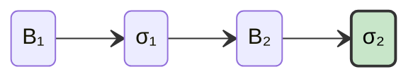

# Lec-22: CL Data Structures by Michael Sproul

More info about lecture: [EPF.wiki](https://epf.wiki/#/eps/day22)

## Overview

This lecture is focused on understanding different data structures used by CL (particularly, Lighthouse). The overview includes:

- In-Memory state representation
- Disk state storage
- Blocks and blobs storage
- SSZ and Merkelization
- Applicability to other clients
- Cache strategy

## Sections Timestamp

| Topic                                        | Time  |
| -------------------------------------------- | ----- |
| Introduction                                 | 0:01  |
| Agenda                                       | 1:50  |
| BeaconState in memory                        | 2:27  |
| Block processing                             | 7:00  |
| Using persistent data structures             | 10:46 |
| Mihouse: Persistent Merkle Tree Rust library | 19:33 |
| Challenges & Benefits                        | 21:14 |
| Upcoming upgrades to Milhouse                | 24:10 |
| Questions                                    | 27:10 |
| BeaconState on disk                          | 31:40 |
| State storage optimisations                  | 35:17 |
| Hierarchical state diffs                     | 38:41 |
| Non finality                                 | 47:08 |
| Which database?                              | 50:20 |
| Storing Blocks & Blobs                       | 51:25 |
| Further reading                              | 55:00 |
| Questions                                    | 56:00 |

## About speaker and lecture outline

Michael Sproul has been working at Lighthouse (Sigma Prime) for more than 6 years.

The outline for the lecture is:
- `BeaconState` in memory
- `BeaconState` on disk
- Blocks and blobs

## `BeaconState` in memory

Beacon state stores all the state information related and specific to consensus layer.

It stores:

- **Validator registry** i.e. public key, withdrawal credentials, activation epoch, etc.
- **Validator balances**
- **Consensus metadata** i.e. pending deposits, slot, withdrawal info

**Note**: It doesn't store *smart contract state* and *account balances*. It is the jurisdiction of the execution layer.

### What it takes to store `BeaconState` in memory?

`BeaconState` is not that humungous in size wrt `ExecutionState`.

In case of Ethereum Mainnet:

- `BeaconState`: **∼250 MB** as SSZ
- `ExecutionState`: **∼1-2 TB**

Simple Serialize (SSZ) is a binary encoding format that is used to encode and represent any form of data that can be stores in the form of string of bytes.

- Read [SSZ: Simple Serialize on Eth2book](https://eth2book.info/capella/part2/building_blocks/ssz/#ssz-simple-serialize) and [ethereum/consensus-specs](https://github.com/ethereum/consensus-specs/tree/master/ssz/simple-serialize.md)

There are primarily three beacon-state related operations:

***1️⃣ Block Processing***

Whenever a new block is either proposed or received via gossip (libp2p), the first responsibility of a consensus client is to process the block by:
1. loading its parent block and parent's state.
2. validating on top of that state to get a new state.
This is called *consensus state transition*.

***2️⃣ Hashing***

In the case of consensus layer, *binary merkle tree* stores all the state information and its root (i.e. computed after block processing) stores the hash of the whole beacon state.

The computed root hash (post-state) must match with the hash received via gossip. If mismatch occurs, then it might be a case of *consensus inconsistency with proposer* of the block (possible in case of bugs).

- Read [Hash Tree Roots and Merkleization: eth2book](https://eth2book.info/capella/part2/building_blocks/merkleization/)

***3️⃣ Reading/Writing from disk***

Reading from disk and writing into disk is one of the most important thing for speed and performance.

>In-memory data representation should be compatible with disk data representation.

The main intention is to keep memory usage low, so that there are no sudden RAM spikes while reading and writing data into disk.

## Block processing

Generally, state transitions during block processing works something like this:

Initially $σ_1$ is in memory as it is the post-state of block $B_1$. Later, after processing block $B_2$, we get a new post-state i.e. $σ_2$.

Now only, $σ_2$ exists in memory ($σ_1$ got mutated into $σ_2$), in equation could be represented as,

$$σ_2 = Δ({B_2.σ_1})$$

where, Δ represents stf.

### In case of reorgs

But, there is a problem with overwriting $σ_1$ → $σ_2$.

In case of reorgs, there is a new state $σ_3$ that emerged from $σ_1$ in a slot after the changes that occured via $B_3$.

Now there is no $σ_1$ with the client (as its overwritten by $σ_2$), so it has to be rebuilt in order to validate $B_3$ which is a slow process. This is called a **cache miss**.

The rebuilding process includes loading data from the disk and redo block processing in order to get to $σ_1$ again. This is one of the major and frequent performance issue.

You really don't know if keeping $σ_1$ is beneficial until a block like $B_3$ gets proposed. This is pretty common mainnet incident (happens almost everyday).

>**The reason behind it is:**
>
>$B_2$ was proposed late hence it didn't gather enough attestations for $B_3$ to build on top of it. $B_2$ is kind of classified as *low quality block* so $B_3$ builds on $B_1$ instead.

The beacon node needs to be able to handle these reorgs and needs to be able to quickly process this block so that it's not then processed late because of the cache miss.

And we don't have unlimited RAM, so storing prior beacon states into memory is not a feasible solution (to combat cache miss).

### Solution

>We want access to many beacon states at the same time with minimal memory usage.

***Solution:** Persistent Data Structures* (using Copy-on-write)

With persistent data structures, the new state doesn't overwrite the old state but rather references the new changes to the old state while not making any changes to it. Read more about it: [Persistent data structure - Wikipedia](https://en.wikipedia.org/wiki/Persistent_data_structure)
### How are peristant data strucure used in CL?

The binary merkle tree of beacon state ($σ_i$) looks something like: 

Now after applying applying state transition to create a new beacon state ($σ_{i+1}$) under the case of a peristent data structure, the updated binary merkle tree would look like: 

Here, the notations to distinguish each node is as follows:

- White: unchanged node values
- Yellow: the node that had its value updated
- Green: the updated node

Like discussed previously, the new updated nodes are referenced to the previous state rather than overwriting it. The old state remains intact (as the yellow nodes are untouched).

We get to have a full version of the old tree, and a full version of the new tree, and can treat those as completely independent values if we want to. They use the approx. same amount of memory or with a bit of overhead for these extra nodes which were added.

### Performance comparisons between Array-like and Tree implementations

- Due to tree traversal in order to reach a leaf node, it takes $O(log n)$ to get, set and append where $n= \text{tree height}$.
- But in order to clone, it take $O(1)$; just reference the root of the tree to generate a clone of it.
- In the case of iteration (traversal), both array and tree vectors take the same $O(n)$, but tree vectors do have a very high constant factor hence its slower than array vectors.

### Milhouse library

- Milhouse library implements immutable vectors in Lighthouse consensus client.
- Implemented Tree vectors to replace all list and vector fields of `BeaconState`.
- Now ∼128 states takes similar amount of RAM to 3-4 full states. Now the client can process any sort of weird side chain that some proposer might throw.
- Now in order to apply new state changes,
  - First clone (really cheap)
  - apply the block
  - Mutate through stf

### Challenges

- Slower iteration
- Memory fragmentation
- Diffs can still be large (due to frequent updates in inactivity scores and balances in every epoch boundary; happened in Holešky: non-finality incident)

### Benefits

- More resilient to forks and reorgs
- Faster block production
- Faster API queries

Usually, in approx. all clients, while proposing i.e. block production, a proposer:
- Gets the current state
- Produces the block on that state
- Computes the post-state
- Broadcast the block to the network
- **THROWS IT AWAY (i.e. post-state)**
- **RE-PROCESS IT AGAIN (like other clients)**

## Upcoming upgrades for Milhouse

Holešky non-finality incident inspired a few upcoming upgrades. Do read: [The Pectra Holesky Incident](https://blog.sigmaprime.io/pectra-holesky-incident.html)

The main two upgrades that did help solve the issue for Holešky are:
- *Intra-rebasing* - share memory for identical values/subtrees within a list.
- *Size-based pruning* - measure cache memory usage and prune to stay within a limit provided.

Regarding ***intra-rebasing***, assume, if there are multiple zero nodes in a binary merkle tree. So rather than creating multiple copies of the same zero node, we make multiple references to same zero node hence reducing the memory space used.

You can basically collapse the whole tree into a linked list where the left and the right children are the same sometimes. Or you can do things where if two subtrees of nodes are the same, then you just reuse the previous subtree

So the implementation for the same is: We have a function that you give it a list, and then it looks at similarities, sort of self-similarities within that list, and then it will reduce the memory usage by taking out these subtrees.

## Questions: Part-1

*Ques.* How this helped in Holešky incident?

*Ans.* The function eliminated a lot of duplication in the inactivity scores reducing the memory usage from 200 MB to ∼100MB.

---

*Ques.* What happens when the memory is overloaded?

*Ans.* Its a bit risky situation. Just set the size of the cache to a specific number of states (32 or 128 states), and just hope that it won't run out of memory.

If ran out of memory, then the lighthouse client will crash (gets killed by OS for using too much memory).

This happened alot during Holešky incident and the solution was to lower the cache-size to 32 states.

Clients crashing out and joining again after a while is not a slashing incident. A validator might lose revenue due to missed attestations, etc.. But slashing is only when a validator misbehaves.

Validators being offline does cause penality but its very small unless the chain is not finalizing (then its hefty).

## `BeaconState` on disk

*Why store data on disk you may ask?* This is where Ethereum potentially lives. All the information that is relevant and important to Ethereum resides on client's disk. So in case of disconnects or crash. The client has enough info to start again. People also need historic block info to calculate their rewards, penalties (what caused them?), and many more. The main intention is evaluate or monitor the state at any given point in history.

Another question. *How frequently to store `BeaconState` on disk?*
- Simplest: write full `BeaconState` every slot
  - 250 MB of IO every slot
  - i.e. 678 TB per year!!! (Impossible)
- Simple: write full `BeaconState` every epoch
  - 250 MB of IO every epoch
  - 20 TB per year!!! (Still quite large)

*How to retrieve info in between block in case of stored `BeaconState` every epoch?*
**Block replay**. So in case, you stored in the last epoch and you need any block from the middle of the epoch. Then the only solution is to start from the last stored block nearest to the block you want. Apply each block between those two points and reach to get the state.

>Go from state $N$ to $N+k$ by recomputing the state transition using known blocks from slots $N...N+k$.

### Optimisations

- ***Don't store historic states by default.*** Full nodes just need 2 epochs of state when the chain is finalizing ∼500MB for 2 epoch boundary states. So it means to only store last 2 epoch states (∼500MB) or last 64 slots states (∼16GB).
- Use a more efficient schema to store historic states ("freezer DB")
    - One state every 8192 slots (old Lighthouse) - implementation takes a lot of time to only provide a snapshot range that has to be built again that takes ∼10 mins.
    - Hierarchical state diffs (lighthouse uses this now)

***Hierarchical state diffs*** (aka on-disk Tree states)

- A more efficient way to access historic blockchain states, balancing storage efficiency with quick retrieval.
- It involves storing very infrequent **full snapshots** (e.g., yearly) and then storing **diffs** at progressively smaller, layered time intervals (e.g., monthly, daily, epoch-level) relative to the layer above.

- *Note*: Yearly, monthly or daily are just an example to cast sense to understand the hierarchy. Generally they are represented in terms of slots where $2^{21} ∼ Yearly$ and so on.
- In order to retrieve a specific historic state, the *system loads the nearest base snapshot and applies a small number of relevant diffs down the hierarchy*, significantly reducing the time compared to replaying thousands of blocks.
- For states within the smallest diff interval (e.g., an epoch), a limited block replay (max 32 blocks) is still used, ensuring precision without significant time cost.
- This hierarchical approach results in much faster query times for historic states and manageable database sizes, making archive nodes more practical and useful for analysis like validator rewards.
- All states since 2020 comprises in under 200 GB.
- Diff density is highly configurable.
- Diff algorithm used is:
  - *zstd* for balances, inactivity_scores
  - *xdelta3* for the rest (validators)
- Diffs are versioned to allow adoption of new algorithms (hence future proof)

Hierarchical state diffs are very useful and an optimised option that helps store archival states. Lighthouse excels at archival nodes along with Erigon with their consensus client Caplin (which is quicker than LH).

- Read [Hierarchical state diffs: Database Configuration - Lighthouse Book](https://lighthouse-book.sigmaprime.io/advanced_database.html#hierarchical-state-diffs) to get better understanding

## Non-finality

- Heirarchical state diffs can't be used on non-finalized states. It only works for those historic states in the freezer database.
- Many clients struggle during non-finality because they can't use the FreezerDB.

### Holešky Incident

- Holešky Incident happened due to this particular issue with non-finality.
- From the perspective of Lighthouse, they store a state every epoch until finalized. So all the non-finalized epochs will be stored until finalized.
- The chain didn't finalize for ∼21 days. Hence, 225 epochs gets added per day resulting in $225 * 21 * 250MB$ of storage aggregating. The disk usage was growing at a really alarming rate.
- This can potentially lead to a death spiral where the network runs out of space, and then people get knocked offline, and then because they're offline, more people run out of space because the chain is still not finalizing.
- We did manage to get it back on Holešky  but through  really unusual way that people probably wouldn't coordinate on mainnet. People basically agreed to slash themselves, which would not happen on mainnet.

### Solution

Use hierarchical state diffs for non-finalized states too! This would not lead to overloading of disk usage exponentially. This is being tested at the moment.

## Which Database?

- Most clients use an embedded database:
  - LevelDB
  - RocksDB
  - MDBX
  - Redb
  - Sqlite
- Most clients use the database as a key-value store (keys→value)
- Database supports atomic writes (or transactions) for maintaining consistency.

## Storing blocks and blobs

- Blocks:
  - Mapping from *block root (key)* to *SSZ block (value)*
  - In future: mapping from *slot (key)* to *SSZ block (value)*

- Blobs:
  - Mapping from *block root (key)* to *SSZ list of blobs (value)*
  - In future: map from *block root and blob index (key)* to *single blob (value)*

## Further reading and recommendations

- Purely Function Data Structures by Chris Okasaki
- Learn You a Haskell [http://learnyouahaskell.com/chapters](http://learnyouahaskell.com/chapters) 
- Persistent data structures in Rust [https://github.com/orium/rpds](https://github.com/orium/rpds) 
- Proto's remerkleable (Python) [https://github.com/protolambda/remerkleable](https://github.com/protolambda/remerkleable) 
- Milhouse [https://github.com/sigp/milhouse](https://github.com/sigp/milhouse)
- Lighthouse database docs [https://lighthouse-book.sigmaprime.io/advanced_database.html](https://lighthouse-book.sigmaprime.io/advanced_database.html)

## Questions: Part-2

*Ques.* Do you have any improvements these strategies for for storing blobs?

*Ans.* Making improvement around blobs are hard because there is no structure to exploit.

`BeaconState` is an always evolving state from its previous version. Whereas, Blobs are pretty random.

Also compressing blobs are difficult with inclusion of PeerDAS due to the erasure encoding.

>One area where there is advancements are tooling for controlling which blobs you want to store and being able to import and export them from nodes.

>Another intention is to host an archive node for all the blobs on the mainnet because no one is really doing this. This could help segregate according to different L2s.

---

*Ques.* How SSZ and Merkleization works? Is it similar to immutable vectors you talked about before?

*Ans.* The **SSZ** representation is a *flat representation of all of the data in the data structure*. To encode  as SSZ, we have a function that can encode a list by iterating along the list and writing out each entry of the list.

When performing SSZ, we *iterate along the leaves of the tree* and *leave out all of the internal nodes* (are only related to Merkelization). That gives us a *fairly similar flat vector of the leaves*.

When things are fixed-size, it's all fairly simple; they just get written out. But when they're variable-sized, they'll get written in a different place with an offset that tells you where they're written.

**Merkelization** is the process of hashing all of the leaves into the internal nodes all the way up to the root.

---

*Ques.* How caches work for both non-finalizing and freezer states?

*Ans.*

**For Freezer States (Historic States):**
- The cache stores historic states in two forms:
  - Diff Bytes: Raw bytes resulting from a diff algorithm.
  - Deserialized Tree: A full state representation in memory (like a Milhouse tree).
- It converts between these representations on demand.

- *Example Explained*:
  - To get state at slot 1023: Load a snapshot, apply diffs to get bytes for 1023, then convert these bytes to a full state for 1023. This full state is cached.
  - To then get state at slot 1024:
    - The cache sees it has the full state for 1023 (and possibly diff bytes for 1023).
    - Option 1 (Short distance): If the full state for 1023 is cached, it might replay one block (apply the diff for 1024) on this full state to get the full state for 1024.
    - Option 2 (Longer distance, e.g., getting 2048): If the cache has diff bytes for 1024, and you request state 2048 (which is diffed off 1024), it would load the diff for 2048 and apply it to the cached diff bytes of 1024 to get the diff bytes for 2048.
- The cache opportunistically uses whichever representation (diff bytes or full state) is most efficient for the requested operation.
- It might store both diff bytes and the full state for a particular slot.
- The current implementation might be inefficient, sometimes storing too much or missing optimization opportunities.

**For Non-Finalized States:**
- It's simpler: a number of recent states (e.g., 32 states, including the finalized state and states from the most recent epoch) are stored in memory.
- Relies on data sharing between these states, as they are based on each other.
- Uses a "rebase" operation:
  - When a new state is acquired, it's often "rebased" on the finalized state.
  - This means it's modified to share as much memory as possible with the finalized state wherever their data is identical.
- This in-memory cache is targeted for size-based pruning to stay within specified RAM limits (e.g., 4GB or 8GB).
